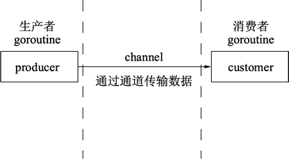

## 前言

> go，代码组织像c语言，语法和一些特性 像 js

## 笔记
- `{`不能单独一行
```gotemplate
	func main()
	{   //错误
	
	}

```
- `:= `只能在函数内使用
### 学习链接
> http://c.biancheng.net/view/2.html 例子错误太多之外，还比较适合新手

> http://tour.studygolang.com/basics/3 可以学习到更多的例子加深使用，适合新手


## 安装


- windows
	- 安装地址：
```cmd

> go run hello.go  # 解析器执行运行

> go build hello.go # 编程成二进制.exe文件，再运行exe


```


- linux
 
## 疑问
1. 无法使用单引号 ？
2. %d ？ 应该是数值？ 数字 double 
3. %T ？？ 打印出来数据类型
4. %V ？？ 打印出来数据类型 Printf()来决定
5. 数组不是一个常量
	- 不能以 const 来声明
6. go如何声明 一串数组 [5454,"xxx",true] 
	- 在go 中，这是一个interface
	
7. for迭代中 可以使用 空白符 "_"省略索引或者值
```gotemplate
for _,num :=range [545,545,5]{
	fmt.Println(num)
}
``` 

8、 如何比较 "2019"==2019？
9、查看数据的 类型 类似， js 中的typeof
10、怎么打印不出来常量 的位操作
> //fmt.Printf("%i",Big)//怎 
> var i int=999 //期待 int

11、发查询反而没有单线程顺序查询快？？
12、在某些场景下，互斥锁要比读写锁更快！！！
> https://studygolang.com/articles/14107#reply1

## 主要特性
- 自动垃圾回收
- 丰富的内置类型
- 函数多返回值
- 错误处理
- 匿名函数和闭包
- 类型和接口
- 并发编程
- 反射
- 语言交互性

## 初试go,hello world

> go run hello.go  直接执行

> go build hello.go


```go
package main //?

import "fmt"//?

//一定要main开头
func main()  {
	fmt.Printf("hello,worl11d \n");
}
```
## 函数包

### 函数执行顺序

- init()
- main()
- customer()


### len(a) 只能是string 吗？

```go
package main
import "fmt"
func main(){
	var numbers =make([]int,3,5)
	printSlice(numbers)
	
}

func printSlice(ints []int) {
	fmt.Println("len=%d cap=%d slice=%v\n",len(ints),cap(ints),ints)
}
```

### cap()
测量切片最大长度可以达到多少

### fmt 

|函数|入参|描述|用例|
|-|-|-|-|
|println(t)||||
|Scan()||||
|Printlh(a,b)||||
|Printf("%d",a)||||


### unsafe.Sizeof() 是干嘛的这个函数

|函数|入参|描述|用例|
|-|-|-|-|
|Sizeof()||||

### fmt.printf()

|符号|描述|
|---|---|
|%d|数字|
|%s|字符串|
|%g||

### append()函数
- 增加切片的容量，必须创建一个新的更大的切片并把原来的分片的内容拷贝进来

```gotemplate
var n []int
n=append(n,9859,556,6)//[9859,556,6]

```
### copy()函数
> copy(n1,n)//n 拷贝到 n1

### fmt.Sprintf()
> fmt.Sprintf("%s:%v",header,rand.Int31())

### rand.Int31()

### time.Sleep(time.Second)

### time.Second

### string->float strconv.ParseFloat() 
### string->int strconv.ParseInt() 
### string->bool strconv.ParseBool() 

### int->string


```gotemplate
str1 :=strconv.Itoa(i) //1 

str2 :=fmt.Srpintf("%d",i)//2

str3 :=strconv.formatInt()//3

```

### int->float float(i)

```gotemplate
	float(i)

```

### int->bool bool(i)

### float->string

```gotemplate
str1 :=strconv.Itof(f) //1 Itoa方法
str2 :=fmt.Sprintf("%f",f) Sprintf 方法
str3 :=strconv.FormatFloat()//FormatFloat 转换
```

### float->int int(i)

### float->bool bool(i)

### bool->string  
```gotemplate
str1 :=fmt.Sprintf("%d",b)
str2 :=strconv.FormatBool()
```
### bool->int int(i)

### bool->float float(i)

### byte->string string(byte)

### byte->int/bool/float encoding/binary

### ini/bool/float -> byte encoding/binary


## 基础代码结构

|描述|用例|
|----|----|
|包声明| |
|引入包| |
|函数| |
|变量| |
|语句&表达式| |
|注释| |
|// -> 标记| |
|关键字| |
|常量| |
|字符串| |
|符号| |
|fm| |
|.| |
|Println| |
|(| |
|"hello world"| |
|)| |

## 保留字
### 关键字

|关键字|描述|
|----|----|
|break ||
|default ||
|func | |
|interface | |
|select | |
|case | |
|defer | |
|go | |
|map | |
|struct | |
|chan | |
|else | |
|goto | |
|package | |
|switch | |
|const | |
|fallthrougt | |
|if | |
|range | |
|type | |
|continue | |
|for | |
|imort | |
|return | |
|var | |

### 预定义标识符

|符号|描述|
|----|----|
|append | |
|bool | |
|byte | |
|cap ||
|close | |
|complex | |
|complex64 | |
|complex128 | |
|uint | |
|uint8 | |
|uint16 | |
|uint32 | |
|uint64 | |
|uintptr | |
|copy | |
|false | |
|float32 | |
|float64 | |
|imag | |
|int ||
|int8 | |
|int16 | |
|int32 | |
|iota | |
|len ||
|make | |
|new ||
|nil ||
|panic | |
|print | |
|println | |
|real | |
|recover | |
|string | |
|true | |

## 声明&&变量


### 声明变量

- 指定变量类型，如果没有初始值，变量默认为零值
> var s ini;

- 根据值自行判定变量类型
> var f= true

- 省略var `:=` 左侧如果没有声明新的变量，会产生编译错误
- 全局声明的变量允许不被使用
- 局部声明的变量，必须要使用，否则会造成编译器报错
```gotemplate
var val int
val := //错误，左侧没有声明新的变量
var,t :=1,2//不会错误

```

```gotemplate
var age int
var str string = "I love the world"//go 中 这个string 类型是可以省略的

```

- 必须空格区分
- 被声明的变量，必须使用，对于局部作用域来说，但全局是允许声明可不使用。
- 可在一行声明多个变量。var e,f =123,"hello" => g,h:=123,"world"，并行赋值|同时赋值
- 不能对变量，重复声明
- 交换两个变量的值，前提是类型相同 a,b=b,a
- 空白标识符，_ 用于抛弃值 _,b=5,7. _ 
- 不能以数字开头
- 不能使用关键字
- 不能使用运算符

### 变量作用域

- 函数内定义的变量：局部变量
- 函数外定义的变量：全局变量
- 函数定义中的变量：形式参数

### 初始化局部和全局变量
- int 初始化 0
- float32 初始化 0
- pointer 初始化 nil
### `:=` 短变量声明，省略var 关键字
- 不能在函数外使用，只能在函数内使用
- 必须不能被声明过

### 常量
const 声明

### 零值
- `0` 数值0
- `false` 布尔 false
- `""` 空字符串

## 值类型和引用类型

### 值类型（*）

	值传递是指在调用函数时将实际参数复制一份传递到函数中，这样在函数中如果对参数进行修改，将不会影响到实际参数。

> (基本类型，存储在栈中，常量)  j=i 将i的值进行拷贝,&i 获取i的内存地址。每次的地址可能不一样


- 以下基本类型都属于值类型
	- int
	- float
	- bool
	- string
> 且变量都直接指向存在内存中的值

- `j = i`,是内存中将i的值进行拷贝，可通过`&i`获取变量 `i`的内存地址,每次内存地址可能不一样， 
- 值类型的变量的值都存在 `栈` 中

|类型|描述|
|----|----|
|int||
|int| |
|float| |
|bool| |
|string| |

- 常量
常量用于枚举
```gotemplate
const {
    Unkown=0
    Female=1
    male=2
}
```
- iota(特殊常量，可以被编译器修改的常量)???	
    
|||||||||
|-|-|-|-|-|-|-|-|
|const (|||\|||const (||
||a=iota||\||||a=iota||
||b=iota||=>|||b||
||c=iota||\||||c||
|)|||\|||)|||

```gotemplate
const (  			
	a=iota				
	b=iota     =>		
	c=iota						
								
```


- iota 用法

```gotemplate
package main
import "fmt"
func main(){
    const (
        a=iota
        b
        c
        d ="haha"
        e
        h
        i
        f=100
        g=iota
        i
    )
}
```


### 引用类型（*）

	引用传递是指在调用函数时将实际参数的地址传递到函数中，那么在函数中对参数所进行的修改，将影响到实际参数。

> (复杂的数据结构，)r2=r1 只有引用被拷贝

## 数据类型


### 布尔类型
- true 
- false

### 数字类型
- 整形int
    - uint8  `0 ~ 255`
    - uint16 `0 ~ 65535`
    - uint32 `0 ~ 4294967295`
    - uint64 `0 ~ 188446744073709551615`
    - int8   `-128 ~ 127`
    - int16  `-32768 ~ 32767`
    - int32  `-2147483648 ~ 2147483647`
    - int64  `-9223372036854775808 ~ 9223372036854775807`
- 浮点
	- float32 IEEE-754 32
    - float64 IEEE-754 64
    - complex64 32位实数和虚数
    - complex128 64位实数和虚数 (实数：有理数+无理数) （复数：实数+虚数）	
- 其他
	- byte uint8
    - rune ini32
    - uint 32/64
    - int 与uint
    - uintptr 无符号整形，存放一个指针pointer
    
### 字符串类型
- UTF-8编码标识的 
- unicode文本

### 派生类型
- 指针类型 Pointer
- 数组类型
- 结构化类型 struct
- Channel 类型
- 函数类型
- 切片类型
- 接口类型 interface
- Map 类型

## 运算符
- :=  (赋值操作符)
```gotemplate
	var a =5;  => a:=5
    var b =false; => b:=false
```
### 算数运算符
- +
- -
- *
- /
- %
- ++
- --

### 关系运算符(都返回：布尔值) -> 

|符号|用例|
|----|----|
|==  |a==b|
|!=  |a!=b|
|>   |a>b |
|<   |a<b |
|>=  |a>=b|
|<=  |a<=b|

### 逻辑运算符
- %% 逻辑 AND 运算符，两边都是true 才true ，否则false  (a&&b)
- || 逻辑 OR  有一个true 则true。否则false			(a||b)
- |  逻辑 NOT 条件为true，则逻辑为false 否则true		!(a&&b)
### 位运算符(都是操作二进制)
- &	与运算符，双目运算符。(a&b) a与b的二进位 相与  (0-0 、1-0、0-1 为0；1-1为1) 

| 8 | 7 | 6 | 5 |  4| 3 | 2 | 1 |
|---|---|---|---|---|---|---|---|
| 0 | 0 | 1 | 1 | 1 | 1 | 0 | 0 |
| 0 | 0 | 0 | 0 | 1 | 1 | 0 | 1 |
| 0 | 0 | 0 | 0 | 1 | 1 | 0 | 0 |

- |	或运算符，双目运算符。(a|b) a与b的二进位 相或 （0-0 为,1-1、1-0、0-1 为1）

| 8 | 7 | 6 | 5 | 4 | 3 | 2 | 1 |
|---|---|---|---|---|---|---|---|
| 0 | 0 | 1 | 1 | 1 | 1 | 0 | 0 |
| 0 | 0 | 0 | 0 | 1 | 1 | 0 | 1 |
| 0 | 0 | 1 | 1 | 1 | 1 | 0 | 1 |

- ^ 	异或运算符，双目运算符。(a^b) a与b的二进位 想异或。（0-0,1-1 都为0,1-0,0-1 为1）

| 8 | 7 | 6 | 5 | 4 | 3 | 2 | 1 |
|---|---|---|---|---|---|---|---|
| 0 | 0 | 1 | 1 | 1 | 1 | 0 | 0 |
| 0 | 0 | 0 | 0 | 1 | 1 | 0 | 1 |
| 0 | 0 | 1 | 1 | 0 | 0 | 0 | 1 |

- <<	左移运算符，双目运算符。(a<<2) a的二进位，整体向左边移动2个位

| 8 | 7 | 6 | 5 | 4 | 3 | 2 | 1 |
|---|---|---|---|---|---|---|---|
| 0 | 0 | 1 | 1 | 1 |1 | 0  | 0 |
| 1 | 1 | 1 | 1 | 0 |0 | 0  | 0 |

- \>>	右移运算符，双目运算符。(a>>2) a的二进位，整体向右边移动，补0

| 8 | 7 | 6 | 5 | 4 | 3 | 2 | 1 |
|---|---|---|---|---|---|---|---|
| 0 | 0 | 1 | 1 | 1 | 1 | 0 | 0 |
| 0 | 0 | 0 | 0 | 1 | 1 | 1 | 1 |

### 赋值运算符

|符号 | 用例           |
|----|----------------|
|=   | c=a+b          |
|+=	 | c+=a   => c=c+a|
|-=	 | c-=a   => c=c-a|
|*=	 | c*=a   => c=c*a|
|/=	 | c/=a   => c=c/a|
|%=	 | c%=a   => =c%a|
|<<= |	c<<=2 => c=c<<2|
|>>= |	c>>=2 => c=c>>2|
|&=	 | c&=2   => c=c&2|
|^=	 | c^=2   => c=c^2|
|｜= | c\｜=2   => c=c\｜2|
### 其他运算符

|符号 |描述|       用例           |
|----|----|-----------------------|
|&|返回变量存储地址|  &a 给出实际地址|
|*|指针变量       |*a 是一个指针变量|

### 运算符优先级
> (使用括号提升表达式运算符优先级)

|优先级|运算符|
|----|-------------|
|7|^ !             |
|6|* / % << >> & &^|
|5|+ - ^           |
|4|== != < <= >= > |
|3|<-              |
|2|&&              |
|1|    |           |
    
## 语句
### 条件语句

- if
```gotemplate
if a>20{		
							
}	
```

- if ..else
```gotemplate
if a>20{

}else{

}
```

- if ..if

```gotemplate 
if a>20{
    if a==30 { 

    }
}
```
- switch

```gotemplate

package main

import "fmt"

fnc main(){
	switch var1 {		
	case var1:			
        ...				
	case var2:			
        ...				
	case var 3			
        ...				
	default:			
        ....			
	}	
}

```
				
- select 
> !!!select 语句类似于 switch 语句，但是select会随机执行一个可运行的case。如果没有case可运行，它将阻塞，直到有case可运行。

```gotemplate
select{						
    case communication clause:	
        statement(s);			
    case communication clause:	
        statement(s);			
}								
```

1. case 都必须是一个通信？？！！
2. channel表达式都会求值？？
3. 所有被发送的表达式都会被求值？？
4. 如果任意某个通信都可以运行，它就会执行，其他被忽略
5. 多个case都可以运行，select随机公平的选出一个执行，其他不会执行
6. 否则 如果有default，则执行
7. 如果没有default 语句，select将会阻塞，直到某个通信可以运行，go不会重新对channel或值进行求值
	
### 循环控制语句
- 只有一种循环结构，for 循环
- for
- for ...for

```gotemplate
package main
import "fmt"

func main(){
	for i,x:= range numbers {
        fmt.Printf("第 %d 位 x 的值 = %d\n", i,x)
    }		
}

```

- break	-> 中断for循环或跳出switch
- continue	->	跳过当前循环剩下语句，进行下一轮循环
- goto	->	将控制转移到被标记的语句
- 无限循环，条件语句永远不为false则无限循环	

## 数组
- 如何声明 一串数组 [5454,"xxx",true]
### 声明数组
	var variable_name [SIZE] variable_type //语法
	
	var balance[10] float // 定义一个长度为10的 float32 类型
	
### 初始化数组
	var balance = [5] float32{9.6,65.5,6.6,.6,9.5,9.66}//err
	var balance = [5] float32{9.6,65.5,6.6,.6,9.5}//success
- 初始化数组中 `{}` 的元素个数不能大于 `[]` 的数字
- `[]`没有设置数字，则自动设置	
- 如果`{}`里面的元素个数小于 `[]`定义的，则会自动补全0.

### 多维数组（省略）

## 指针
- 一个指针变量指向一个值的内存地址

## 结构体

- @TODO 数组可以存储同一个类型的数组
- @TODO 数组如何支持结构体 arr=[999,"899",false]
- @TODO 那只是属性而已，怎么去调用方法？？


- 结构体实例
```go
package main
import "fmt"

type Books struct {
	title string
	author string
	page int
}

func main()  {
 fmt.Println(Books{"三百六十行","孙悟空",999})
 
 // 当然也可以使用key value
 fmt.Println(Books{title:"哇哈哈",author:"宗庆后",page:666})
 
 // 忽略字段为 0 或 空


 fmt.Println(Books{title:"演员的自我修养",author:"无名氏"})
}


```

- 结构体语法
```gotemplate
//
 type struct_variable_type struct{
    member definition
    member definition
    ...
    member definition
 }
 
 ```
 
### 结构体指针

## 切片(slice)
[slice切片](./slice.go)

- 对数组的抽象
- “动态数组”——切片
- 长度不限制
- make函数创建切片

### 切片如何转数组

### 定义切片
> var xx []type //不需要说明长度

### 切片初始化
> s:=[] int {1,2,3}

## 语言范围 TODO
- range 关键字用于for循环中 迭代 数组、切片、通道、集合的TODO?
- range在数组、切片中它返回元素和索引和索引对应的值
- range在集合中，返回key-value对 的key值
> https://www.runoob.com/go/go-range.html

## interface 接口

## 并发concurrent


## 通道channel


## 函数

```gotemplate
package main
import "fmt"

func hello([参数list])[return_types]{
            //functions body
}
```

1. func 声明函数
2. hello 函数名称，
3. 函数签名= 函数名+参数列表
4. 实参，参数类型、顺序、参数个数，可选
5. return_types 返回类型，返回返回一列值，return_types 是该列值的数据类型，不是必须，有些功能不需要返回值
6. 函数体 里面搞什么
7. 返回多个值

```go
package main
import "fmt"
func main()  {
    world("9","2")
}
func world(x,y string)(string,string){
    return x,y
}
```

8. 函数如果使用参数，则该变量成为函数的形参
9. 形参类似定义在函数体内的 局部变量
10. 值传递，在函数体内去修改，不会影响，因为是属于基本类型的的拷贝值
11. 引用传递参数的话，在函数体内去修改，会影响外部参数
12. 函数可作为值，被赋值给其他o变量
13. 最少要有一个main函数
### 函数闭包

```go
package main 
import "fmt"
func getSequence() func() int{
    i:=0//var i int = 0
    return  func() int{
        i+=1
        return i
    }
}
func main(){
    nextNumber :=getSequence()//nextNumber 为一个函数，值为0
    fmt.Println(nextNumber())
    fmt.Println(nextNumber())
    fmt.Println(nextNumber())
    preNumber :=getSequence()//新的函数
    fmt.Println(preNumber())
    fmt.Println(preNumber())
}
```
### 递归函数
go 实现 斐波那契数列函数

```go
/**
@desc 递归 recursion

*/
package main

import (
	"fmt"
)

//
func recursion(num int) int {
	if num <= 1 {
		return 1
	}
	return recursion(num-1) + recursion(num-2)
}

func main() {
	var a = recursion(8)
	fmt.Println(a)
}


```
## 字符

- 字符串链接使用 `+`来实现


## 标准库包
|包名   |描述   |
|---    |---   |
|bufio	|带缓冲的 I/O 操作|
|bytes	|实现字节操作|
|container	|封装堆、列表和环形列表等容器|
|crypto	|加密算法|
|database	|数据库驱动和接口|
|debug	|各种调试文件格式访问及调试功能|
|encoding	|常见算法如 JSON、XML、Base64 等|
|flag	|命令行解析|
|fmt	|格式化操作|
|go|	Go 语言的词法、语法树、类型等。可通过这个包进行代码信息提取和修改|
|html	|HTML 转义及模板系统|
|image	|常见图形格式的访问及生成|
|io	|实现 I/O 原始访问接口及访问封装|
|math|	数学库|
|net|	网络库，支持 Socket、HTTP、邮件、RPC、SMTP 等|
|os|	操作系统平台不依赖平台操作封装|
|path	|兼容各操作系统的路径操作实用函数|
|plugin|	Go 1.7 加入的插件系统。支持将代码编译为插件，按需加载|
|reflect|	语言反射支持。可以动态获得代码中的类型信息，获取和修改变量的值|
|regexp	|正则表达式封装|
|runtime|	运行时接口|
|sort	|排序接口|
|strings|	字符串转换、解析及实用函数|
|time	|时间接口|
|text	|文本模板及 Token 词法器|

## http

```go
/**

@desc go 建立 http 服务器

*/
package main

import (
	"io"
	"log"
	"net/http"
)

func main()  {
		goServer()
}

func goServer() {
	http.HandleFunc("/",httpServer)
	err := http.ListenAndServe(":8888",nil)
	if err !=nil {
		log.Fatal("ListenAndServe",err)
	}
}

func httpServer(w http.ResponseWriter,req *http.Request)  {
	_, _ = io.WriteString(w, "hello,world11\n")
}

```

## 内置依赖包

> 摘录自 https://studygolang.com/static/pkgdoc/main.html

|main|sub|描述|
| --- | --- | --- |
|archive|       | 档案| 
|       | tar | tar包实现tar格式压缩文件存取| 
|       | zip | zip提取zip档案文件读写 | 
| bufio  | | 带缓存I/O操作 | 
| builtin | | 为Go预声明标识符提供了文档 | 
| bytes  | | 操作[]byte的常用函数 | 
| compress  | | | 
|   | bzip3| | 
|   | flate| | 
|   | gzip | | 
|   | lzw| | 
|   | zlib| | 
| container  | | | 
|   | heap| | 
|   | list| | 
|   | ring| | 
| context  | | | 
|   | | | 
|   | | | 
|   | | | 
|   | | | 
|   | | | 
|   | | | 
|   | | | 
|   | | | 
|   | | | 
|   | | | 
|   | | | 
|   | | | 
|   | | | 
|   | | | 
|   | | | 
|   | | | 
|   | | | 
|   | | | 
|   | | | 
|   | | | 
|   | | | 
|   | | | 
|   | | | 
|   | | | 

## 算法

### 倍数算法，此时for 也类似while
```go
package main

import "fmt"

func main()  {
	sum :=1
	for sum <64{
		fmt.Println(sum)
		sum+=sum
	}
	fmt.Println("end:",sum)
}


/*
  1
  2
  4
  8
  16
  32
  sum:64
  */
```

### 牛顿法实现开平方函数

简单10次循环找差值

```go

package main

import (
	"fmt"
)

func Sqrt(x float64) float64 {
	z := float64(1)

	for i:=0;i<10 ; i++{
		z -= (z*z - x) / (2 * z)
		fmt.Println(z)
	}
	return z
}

func main() {
	fmt.Println(Sqrt(8))
}

```

- 完善型牛顿法
```go

package main

import (
	"fmt"
)

func Sqrt(x float64) float64 {
	const E = 0.000001
	z := float64(1)
	k := float64(0)
	for ; ; z -= (z*z - x) / (2 * z) {
		if z-k <= E&&z-k >= -E {
			return z
		}
		k = z
	}
}

func main() {
	fmt.Println(Sqrt(8))
}

```

